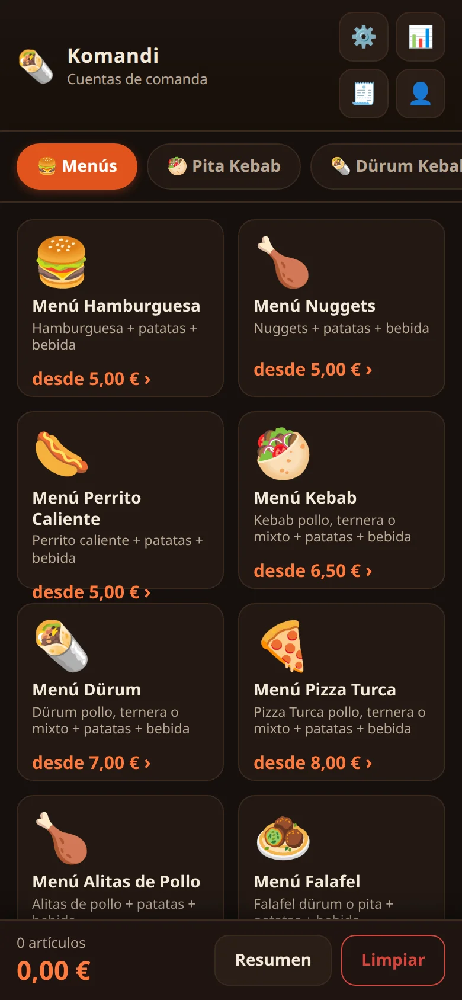
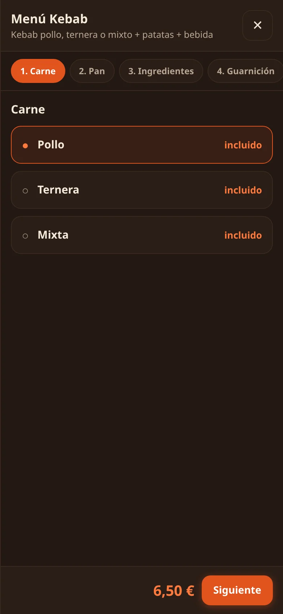
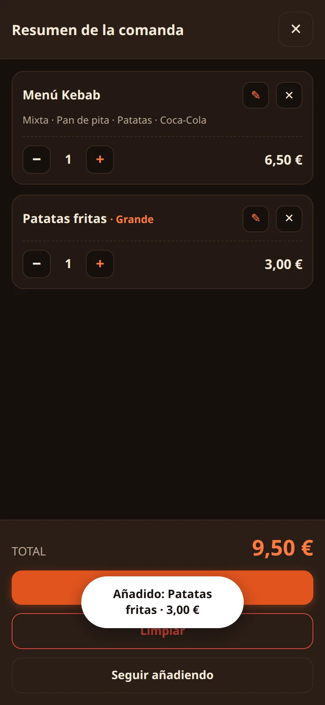
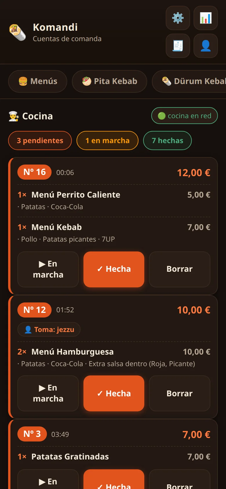
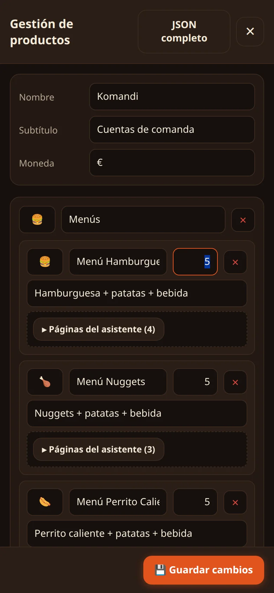
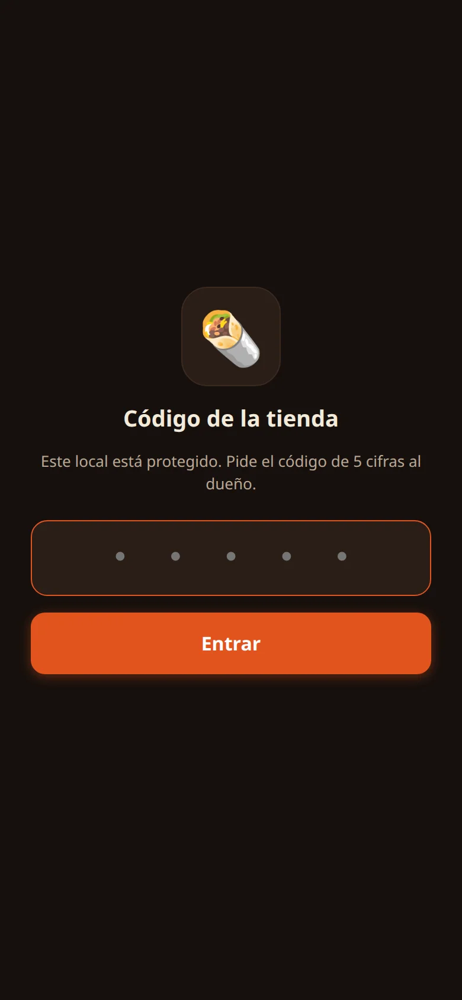

# 🥙 Komandi

**La comanda de tu negocio, en el móvil que ya tienes.**

App PWA de **comandas para comida para llevar**: el comandero toma el pedido en su
móvil (pestaña **Carta**) y la **Cocina** ve el ticket en vivo al instante en otro
dispositivo. Hecha para kebab, hamburgueserías, pizzerías, pollos, bocadillerías,
tacos, food trucks… y cualquier local que pida en el mostrador y pase a cocina.

Sin terminales. Sin comisiones por pedido. Sin permanencia. En marcha en 10 minutos.

---

## 📸 Así se ve

Capturas de la app en uso real, con datos de un kebab de verdad. *(Se actualizan
solas en este README si sustituyes las imágenes en `assets/capturas/` manteniendo
el mismo nombre.)*

| | | |
|:-:|:-:|:-:|
| **Carta por categorías**  | **Asistente de pedido**  | **Resumen con total**  |
| **Ticket en vivo en cocina**  | **Editar precios desde el móvil**  | **Acceso protegido por PIN**  |

---

## ✨ Qué hace

### 📋 Carta y pedido
- Carta por **categorías** con emoji/imagen, nombre, descripción y precio de cada producto.
- Asistente de pedido paso a paso: **tamaños**, carnes, **ingredientes** (con stepper y
  `precioExtra` por unidad) y **extras/salsas** con su precio.
- **Total calculado al momento**: sumas de extras, notas ("Sin cebolla"), subtotal y total.
- Barra inferior siempre visible con nº de artículos y total acumulado.

### 🧾 Resumen y comanda
- Desglose por artículo: tamaño, notas, modificaciones con precio (`+0,40 €`), cantidades.
- **Copiar comanda en texto plano** lista para WhatsApp o apuntar.
- Campo **"Para quién"** (mesa 8, para llevar…): sale como badge en cocina y en el historial.
- **Nº de ticket que se reinicia cada día**, como la comanda de papel.

### 👨‍🍳 Cocina en vivo
- El ticket llega a cocina **al segundo** y se ve en varios dispositivos a la vez.
- Estados: **pendiente → en marcha → hecha**, con quién tomó (`👤 cajero`) y quién
  prepara (`👨‍🍳 cocinero`) cada comanda.
- Resumen de cocina: nº de pendientes / en marcha / hechas.
- Sin internet: la app pasa sola a **modo local** y las comandas se guardan en el dispositivo.

### 🔒 Seguridad
- **PIN de tienda** opcional: solo los móviles del local entran; un token por dispositivo.
- Revocación al instante si se pierde o cambia un móvil.
- Datos **respaldados y solo tuyos**.

### ⚙️ Gestión sin saber programar
- **Edita productos, precios y tamaños desde el móvil** (panel ⚙️), sin herramientas externas.
- Editor JSON completo para cambios avanzados.
- La pestaña Cocina está protegida: no se puede borrar ni tocar por error.

### 📱 PWA: instalable y offline
- Se añade a la pantalla de inicio como una app normal, **sin pasar por Play/App Store**.
- Funciona **sin conexión** una vez cargada.
- Android, iPhone, tablet o PC (Windows, macOS, Linux): cualquier navegador moderno.

---

## 💶 Planes

| | 📅 Mensual | 🗓 Anual | 🛠 A medida |
|:-:|:-:|:-:|:-:|
| **Precio** | **14,99 €/mes** | **149,99 €/año** | Presupuesto aparte |
| **Alta** | 29,99 € (una vez) | ✅ Incluida | — |
| **Permanencia** | Sin permanencia | Sin permanencia | — |
| **Extra** | Primer mes gratis | 12 meses al precio de 10 | Calculadora de presupuesto en la web |

Todos los planes incluyen la **app completa** (carta, asistente, cocina en vivo,
resumen y estadísticas por día), protección por PIN, configuración en colaboración
contigo, gestión de dispositivos y soporte por WhatsApp, Instagram y email de
**10:00 a 20:00**.

> Sin comisión por pedido. Sin contrato. Primer mes gratis.

---

## 🚀 Pruébala ahora

La **demo gratuita** es la app de verdad con un menú de ejemplo, **sin PIN**, sin
registro y sin caducidad: [`demo/index.html`](demo/index.html).

*Se regenera con `node build-demo.js` a partir de `../base/` y los datos de ejemplo.*

> ⚠️ **Temporal**: el enlace a la demo es provisional. Cuando la web esté desplegada
> apuntará a su URL definitiva.

---

## 💪 Ventajas de Komandi

- **💰 Precio de verdad bajo**: menos que un pedido para llevar al mes. Tarifa
  plana, sin letra pequeña.
- **🚫 Sin comisión por pedido**: el margen se queda en tu negocio, no se va a una
  app de delivery.
- **📱 Sin TPV ni terminales**: usas los móviles y tablets que ya tienes. Nada que
  comprar, nada que instalar (PWA).
- **⚡ En marcha en 10 minutos**: abres la URL, pones el PIN y ya funciona.
- **🍳 Comanda cajero → cocina en vivo**: la cocina ve el ticket al segundo, sin
  gritos ni papeles que se pierden.
- **✏️ Carta editable por el dueño**: productos, precios y tamaños desde el móvil,
  sin saber programar.
- **📶 Funciona sin internet**: modo local + PWA offline. Una caída de red no para
  el negocio.
- **🔒 Tus datos son tuyos**: respaldados, protegidos por PIN y solo los ves tú.
- **🤝 Sin permanencia ni contrato**: y el primer mes es gratis.

---

## 🧩 Para qué negocio vale

Si tomas el pedido en el mostrador y la cocina necesita verlo, te vale:

🥙 Kebab/Döner · 🍔 Hamburguesería · 🍕 Pizzería · 🍗 Pollo asado o frito · 🥪 Bocadillería ·
🌮 Tacos · 🍟 Comida rápida · 🥞 Crêpes/gofres · 🥡 Takeaway · 🚚 Food truck

---

## 🔧 Tecnología

Web estática y ligera, sin frameworks: HTML/CSS/JS puro + PWA (manifest y service
worker). Backend de la app: Node.js vanilla (un `server.js`, sin dependencias) y
datos en JSON. Coste de infraestructura casi nulo.

---

## 📬 Contacto

Los datos de contacto (WhatsApp, Instagram, email) y el horario de atención se
publican en la **web**. De momento, el enlace es temporal y todavía no lleva a
ningún sitio:

**[🌐 Ver la web](https://tudominio-pendiente.com)** — *enlace temporal, se
actualizará con la URL definitiva cuando la web esté desplegada.*

---

## 📄 Licencia

MIT. Libre para copiar, usar y contribuir.
